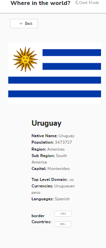
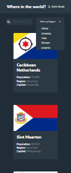

# Frontend Mentor - REST Countries API with color theme switcher solution

This is a solution to the [REST Countries API with color theme switcher challenge on Frontend Mentor]

### The challenge

Users should be able to:

- See all countries from the API on the homepage
- Search for a country using an `input` field
- Filter countries by region
- Click on a country to see more detailed information on a separate page
- Click through to the border countries on the detail page
- Toggle the color scheme between light and dark mode

#### screenshot

## Desktop

https://user-images.githubusercontent.com/96140653/163897307-3c35b09c-38ca-4465-b5e8-7327d50f05ee.mp4

## mobile 

### Built with

- Semantic HTML5 markup
- CSS custom properties
- Flexbox
- SCSS

## ainda em desenvolvimento
